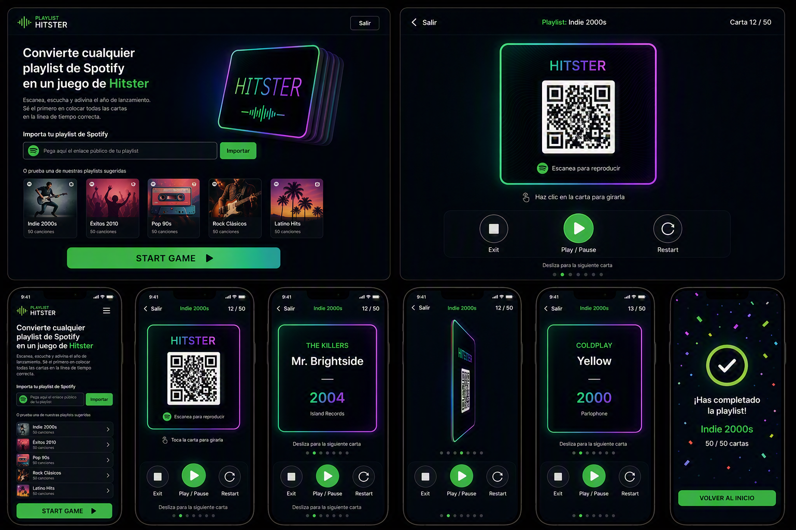

# Custom Hitster — Plan

A web app that turns a public Spotify playlist link into a playable digital Hitster deck.

---

## 1. Goal & Core Loop

**Input:** user pastes a public Spotify playlist URL → presses **Start**.

**Output:** a shuffled digital deck, played entirely in the browser.

```
Paste playlist URL
      ↓
  [ Start ]  → fetch tracks → shuffle → resolve year of card 1 ONLY
                                             └─ cards 2..n resolve in the
                                                background, during play
      ↓
┌─────────────────────────────────────┐
│      Card, "hidden" side            │  ← QR always shown, reveal nothing
│               QR                    │
│ [■ Exit] [▶ Play/Pause] [↺ Restart] │
└─────────────────────────────────────┘
   tap  → flip to reveal  → Title / Artist / Year
   swipe → next card
      ↓
  loop until deck empty OR [ Exit ]
```

**Visual mockup:**



Left-to-right/top-to-bottom: desktop landing page (URL input + suggested playlists from Phase 6), desktop card view showing the hidden QR side, then the mobile flow — landing, hidden side (QR + Exit/Play-Pause/Restart), revealed side (title/artist/year), the CSS 3D flip mid-transition, a second revealed card, and the end-of-deck screen.

**Non-negotiables from the brief**

- Hidden side must not leak title, artist, or year — that is the whole game.
- Tap = flip. Swipe = next card.
- Deck ends naturally (no cards left) or manually (Exit button on the card, which ends the session and redirects to the landing page).
- **Start waits on exactly one year — card 1's. Never on the whole deck.** At MusicBrainz's 1 req/s a 100-track playlist is ~100 s (~200 s at the two-requests-per-track figure of [plan.phase-2-year.md](./plan.phase-2-year.md) decision 19); resolving up front would mean minutes of loading screen before the first card. Cards 2..n resolve in the background while the player is looking at card 1. See §3.

---

## 2. Key Constraints (researched Aug 2026 — these shape everything)

Spotify's Feb 2026 Web API changes broke the obvious implementation:

| Constraint                                                                                            | Consequence                                      |
| ----------------------------------------------------------------------------------------------------- | ------------------------------------------------ |
| **Client Credentials can no longer read playlist `items`** — metadata only                            | A simple server-side API key proxy is dead       |
| **User-authorized (PKCE) returns `items` only for playlists the logged-in user owns/collaborates on** | Would work for "make your own playlist"…         |
| **…but new Development Mode apps are capped at 5 invited Spotify users**                              | …and therefore cannot serve "anyone with a link" |
| **Extended Quota Mode requires a registered org with 250k+ MAU** (since May 2025)                     | Not attainable for this project                  |
| `preview_url` removed from Web API responses for new apps (Nov 2024)                                  | Official API can't give us audio either          |
| Spotify-owned editorial/algorithmic playlists return 404                                              | Fine — users make their own playlists            |

### Decisions taken

- **Audience: anyone with a public link.** → No Spotify login. → The official Web API cannot serve us. → We read the **public embed endpoint** (the approach the reference repo's "scraper mode" uses).
- **Playback: QR is always shown** on the hidden side (so a second device/phone can always scan-and-play in Spotify), **plus** in-app background playback when available — controlled by explicit **[■ Exit] / [▶ Play/Pause] / [↺ Restart]** buttons (Exit ends the game session and returns to the landing page). Background audio is additive, not a replacement for the QR.
- **Release year comes from MusicBrainz, not Spotify.** Spotify returns the _album edition's_ date, so remasters and compilations give wrong years (a 2011 remaster of Bohemian Rhapsody → 2011). MusicBrainz's earliest release date for a recording is exactly the value Hitster needs. This makes year resolution a **core component**, not an enrichment pass. **Fallback — tiered, MusicBrainz-only (revised 2026-08-03):** ~~use the year from the Spotify embed data~~ — **there is no Spotify year to fall back to.** The Phase 0 embed spike (§5) established that the payload carries no release date and no album name at track level, and playlist-level `releaseDate` is null. The fallback is therefore three MusicBrainz tiers: a **strict** pass (official studio album, filtered per the Phase 0 fix) marked high confidence; a **relaxed** pass with the release-group filters dropped, marked low confidence; and finally **no year at all**. Low-confidence years are flagged exactly as the original "unconfirmed" wording intended — but **on the card's revealed side, never on a pre-Start screen**: the player is the one pasting the playlist, so a list of years before Start would spoil the whole deck (§6).

> ⚠️ **Worth knowing:** scraping the embed endpoint and hiding/reskinning the embed player are outside Spotify's Developer Terms, and these unofficial endpoints can change without notice. Acceptable for a personal project; it does mean the QR fallback (step 3 below) must always remain functional so the app degrades instead of dying.

---

## 3. Architecture

```
Browser (SPA)                          Serverless (Vercel Functions)
┌──────────────────────┐               ┌─────────────────────────────────┐
│ Paste URL → Start    │──────────────▶│ /api/playlist                   │
│                      │               │  · parse playlist id            │
│                      │               │  · fetch open.spotify.com/embed │
│                      │◀──────────────│  · extract trackList JSON       │
│                      │  normalized   │  · return {id,title,artist,     │
│                      │  cards        │     previewUrl?}                │
│                      │               ├─────────────────────────────────┤
│ progressive fill     │──────────────▶│ /api/year  (one per track)      │
│ (start on card 1)    │◀──────────────│  · MusicBrainz earliest release │
│                      │  year          │  · 1 req/s gate + cache        │
├──────────────────────┤               └─────────────────────────────────┘
│ shuffle (seeded)     │                              ↓
│ flip / swipe / audio │                     Cache (Upstash/Vercel KV)
│ localStorage resume  │
└──────────────────────┘
```

**Why a serverless backend at all** (the game itself is pure client-side):

1. CORS — the embed endpoint can't be fetched from the browser.
2. MusicBrainz requires a real `User-Agent` (unsettable in browser `fetch`) and 1 req/s.
3. A shared year cache across all users makes repeat playlists instant.

**Why progressive loading matters:** MusicBrainz at 1 req/s means a 100-track playlist takes ~100s worst case. So: resolve years in the background, start the game as soon as **card 1** is ready, and only block if the player outruns the resolver.

**Shuffle before resolving, not after** — the ordering matters and the two are easy to get backwards. Resolution must run **in final deck order**, so "resolve card 1 first" means the first card of the _shuffled_ deck, not the first track of the playlist. Resolve-then-shuffle would spend the first request on a track that lands somewhere random in the deck, leaving the actual card 1 unresolved and Start blocked on a lookup that already finished for someone else's card. Shuffle is pure and instant (seeded Fisher–Yates, no network), so there is no reason to defer it.

### Recommended Stack

| Layer              | Choice                                                                     | Why                                                                                                                  |
| ------------------ | -------------------------------------------------------------------------- | -------------------------------------------------------------------------------------------------------------------- |
| Build/Framework    | **Vite + React 19 + TypeScript**                                           | Client-heavy animated game; no SSR benefit. _(Alt: Next.js if you'd rather have one framework for UI + API routes.)_ |
| Styling            | **Tailwind CSS v4**                                                        | Fast iteration on a card-centric layout                                                                              |
| Animation/Gestures | **Motion (framer-motion)** — `drag="x"`, `onDragEnd`, `AnimatePresence`    | Swipe-to-next + stacked deck exit animations in very little code                                                     |
| Card flip          | **Plain CSS 3D** — `preserve-3d`, `rotateY(180deg)`, `backface-visibility` | No library needed; GPU-composited                                                                                    |
| QR                 | **`qrcode`** (canvas/SVG)                                                  | Encode `https://open.spotify.com/track/{id}` — universal link opens the app                                          |
| State              | **`useReducer` + localStorage**                                            | App is small; keeps deps low. _(Alt: Zustand + persist middleware)_                                                  |
| Backend            | **Vercel Functions (Node runtime)**                                        | Custom User-Agent, secrets, same deploy as frontend                                                                  |
| Cache              | **Upstash Redis / Vercel KV**                                              | Year lookups + playlist snapshots; in-memory fallback for local dev                                                  |
| Tests              | **Vitest** for pure logic; Playwright optional                             | URL parsing, shuffle, year resolution are the bug-prone parts                                                        |
| Deploy             | **Vercel**                                                                 | Static SPA + functions, free tier                                                                                    |

---

## 4. Risks & Mitigations

| Risk                                                       | Mitigation                                                                                                                                                      |
| ---------------------------------------------------------- | --------------------------------------------------------------------------------------------------------------------------------------------------------------- |
| Embed endpoint changes/breaks                              | Isolate all scraping in one adapter module with its own tests; QR is always shown regardless, so the game stays playable                                        |
| Embed JSON truncates long playlists                        | **Spike this first** (Phase 0). If capped, add pagination or a manual track-paste fallback                                                                      |
| No `audioPreview.url` / no in-app playback for some tracks | Play/Pause button is simply disabled/hidden for that card; QR and Exit are unaffected and always work                                                           |
| MusicBrainz has no match / is unavailable                  | **Relaxed second MusicBrainz pass** (release-group filters dropped), marked low confidence, then no year — see §2. There is **no Spotify year to fall back to** |
| MusicBrainz wrong or ambiguous match                       | Low-confidence years flagged **as unconfirmed on the revealed side**, editable there — never in a pre-Start list, which would spoil the deck (§6)               |
| MusicBrainz slow (1 req/s)                                 | Global cache + progressive loading + start game on card 1                                                                                                       |
| Tap vs swipe gesture conflict                              | Movement threshold in `onDragEnd`; `touch-action: none`; disable pull-to-refresh                                                                                |
| Autoplay blocked by browsers                               | Playback always begins from an explicit user tap                                                                                                                |

---

## 5. Step Plan

### Phase 0 — Spikes (decision gate; do this before writing app code)

- [x] Spike: fetch `open.spotify.com/embed/playlist/{id}` server-side; extract the track list JSON. Record **max tracks returned** and available fields.
  - **Where the data lives:** GET the embed page with a normal browser `User-Agent`; response is HTTP 200 HTML containing `<script id="__NEXT_DATA__" type="application/json">`. Parse that JSON; tracks are at `props.pageProps.state.data.entity.trackList`.
  - **Max tracks returned: capped at 100 — confirmed by truncation, not just assumed.** "Rock Classics" (`37i9dQZF1DWXRqgorJj26U`), independently reported to hold 200 saved tracks, returned exactly 100 `trackList` entries. "Today's Top Hits" returned 50, matching its actual size (not a truncation case). **No pagination signal exists anywhere in the payload** — no total count, offset, or `hasMore` field — so the response is indistinguishable between "this playlist has ≤100 tracks" and "this playlist was silently truncated." This confirms the risk flagged in §4: **v1 needs either a documented 100-track limit or a manual-paste fallback for longer playlists** — the embed endpoint itself offers no way to page past track 100.
  - **Playlist-level fields:** `name`/`title`, `uri`, `id`, `subtitle` (owner, e.g. "Spotify"), `coverArt.sources[]`, `releaseDate` (null), `duration`, `isPlayable`, `isExplicit`, `trackList[]`, `visualIdentity` (theme colors), `attributes[]` (key/value pairs, e.g. `isAlgotorial`, `status`), `format`.
  - **Track-level fields (union across 150 sampled tracks):** `uri`, `uid`, `title`, `subtitle` (artist name(s) as **one joined string**, not a structured array — needs splitting), `isExplicit`, `isNineteenPlus`, `contentRatings.labels[]`, `duration` (ms), `isPlayable`, `playabilityReason`, `audioPreview.{format,url}`, `entityType`. **No album name and no release date/year at track level** — validates the plan's decision that year must come from MusicBrainz, not this endpoint.
  - **`audioPreview.url` coverage:** 100/100 tracks had it on the "Rock Classics" sample — promising, but this was one playlist; the dedicated Phase 0 preview-coverage spike below should confirm on a broader/newer sample.
  - **Error shape is not HTTP-status-based:** a nonexistent playlist ID still returns HTTP 200; the JSON's `pageProps` has `{status: 404, title: "Page not found", ...}` instead of `{state: {...}}`. The adapter must branch on `pageProps.state` presence, not on the HTTP response code. (Private playlists not tested — no ID on hand — but likely shaped the same way, to avoid leaking existence.)
  - **Dead end worth recording:** the embed JSON also leaks a short-lived anonymous Spotify Web API bearer token at `state.settings.session.accessToken`. Tried it against `api.spotify.com/v1/playlists/{id}/tracks?offset=100` to fetch tracks 101–200 directly — immediate `429 QUOTA_EXCEEDED`. The embed's client ID is shared globally by every visitor loading any embed on the internet, so its quota is already exhausted; **not usable** as a pagination workaround.
- [x] Spike: confirm whether `audioPreview.url` is present per track, and measure coverage across a real 50-track playlist.
  - **Coverage: 398/400 tracks (99.5%)** across 5 genre/era-diverse playlists, each independently fetched and identity-verified via `entity.uri` (to rule out a stale/wrong playlist): Today's Top Hits (current pop, 50/50), Rock Classics (60s–2020s rock, 100/100), RapCaviar (hip-hop, 50/50), Reggae Classics (98/100), All Out 80s (100/100).
  - **The only gaps were both older reggae catalog tracks** — "Uptown Top Ranking – Remastered 2001" (Althea and Donna) and "Stir It Up" (Bob Marley & The Wailers) — consistent with the plan's general expectation that older/remastered catalog is where preview coverage is most likely to thin out. Sample is small (n=2 missing), so treat as a directional signal, not a hard rule.
  - **Conclusion: coverage is high enough that `previewUrl` + `<audio>` is a solid primary path**, with the Play/Pause and Restart buttons simply disabled on the rare track that lacks one (Exit and QR remain unaffected) (per the existing risk mitigation in §4) — no need to lean on the iFrame API purely for coverage reasons. The iFrame API spike below still matters for the "hidden/no-metadata-leak" requirement specifically.
  - **Methodology note:** an earlier attempt fanned this out across 5 parallel subagents that all wrote to the same generic filename (`embed.html`) in the shared scratchpad, causing a write-race — two agents silently read a different playlist's data (one caught it via `entity.name`, one didn't). Re-ran sequentially with per-playlist filenames and an `entity.uri` identity check per fetch; numbers above are from that clean run.
- [x] Spike: Spotify **iFrame API** — can a visually hidden/covered embed be driven by `play()`/`pause()` with no metadata visible?
  - **Ruled out on Terms-of-Service grounds, independent of technical feasibility.** Spotify's official embed terms (`developer.spotify.com/documentation/embeds/terms`) state: _"You shall not obfuscate the Spotify Widgets in any way, whether by banner advertisements or by any other means, or alter the form or format of the Spotify Widgets from that made available by Spotify"_ and _"You shall display the Spotify Widgets in the form made available by Spotify, without alteration..."_ A hidden or covered iframe is exactly what these clauses prohibit — so even if `play()`/`pause()` could be driven on a hidden embed, doing so would violate the terms this project already accepts some risk under (§2's ⚠️ note), and there's no upside to add that specific extra violation on top when the alternative below already works.
  - **No technical upside to chase anyway:** the previous spike already found `previewUrl` + `<audio>` covers 99.5% of tracks. The iFrame route's only remaining selling point would've been full-track playback or better reliability — not worth pursuing given the ToS blocker.
  - **Process note:** the planned 5-way fan-out (docs, JS bundle inspection, media-session leak risk, autoplay/gesture policy, live test harness) failed 5/5 mid-run — the org hit its Claude monthly spend limit. One agent's partial output before it died had already surfaced the ToS quote above; a direct follow-up `WebFetch` (main thread, not a subagent) confirmed it and was enough to close this spike. The other four angles (JS event payload shape, OS media-session behavior, autoplay-gesture nuances for cross-origin iframes) were not completed and don't need to be — they were only relevant to evaluating an approach now ruled out.
- [x] Spike: MusicBrainz recording search — accuracy of earliest-release-date on 15 known-tricky tracks (remasters, compilations, live versions).
  - **Naive top-scored-recording lookup is unreliable: only 1 of 18 tested lookups (~6%) returned the correct year on the first try.** Tested 15 tricky tracks (3 remasters, 3 compilation/reissue classics, 3 famous-live-version tracks, 2 more live/bootleg-heavy rock classics, 1 clean control track, and 3 cover-vs-original pairs each queried twice = 18 total artist+title lookups) against `GET /ws/2/recording/?query=recording:"TITLE" AND artist:"ARTIST"`, taking the top-scored result's earliest linked release date. Only "Smells Like Teen Spirit" (Nirvana) came back correct on the first pass (1991); "Layla" (Derek and the Dominos) was off-by-one (1971 single vs. 1970 album); all other 16 lookups returned a wrong year — usually a live bootleg, remix, or reissue recording with a completely unrelated date (examples: "Stairway to Heaven" → 2025 bootleg box set; "Like a Rolling Stone" → 2002 Dylan bootleg out of 706 same-scored candidates; "Free Bird" → 1998 live album instead of 1973 studio).
  - **Root cause: MusicBrainz has no single canonical recording per song — every bootleg, live take, remix, and reissue of a famous track is its own recording entity, and dozens tie at the maximum relevance score.** For classic-rock catalog especially (Dylan: 706 matching recordings, "Free Bird": 166, "Stairway to Heaven": 842), the search API ranks by text match only, with no notion of "the original studio recording."
  - **Remaster-suffixed titles, as Spotify would actually present them (e.g. "Bohemian Rhapsody - Remastered 2011"), returned zero MusicBrainz results in every case tested.** The literal suffix breaks the query; titles must be stripped of "- Remastered YYYY" / "- Remaster" / "- Live" / "(feat. X)"-style suffixes before querying — mandatory, not an optimization.
  - **A fix was verified correct in all 12 cases it was tried on: bias the candidate pool toward `release-group` entries with `primary-type: Album` and no `secondary-types` of Live/Compilation/Remix/Bootleg (and release `status: Official`), instead of trusting the recording search's relevance score.** This resolved all 3 compilation-era tracks (Billie Jean, Sweet Child O' Mine, Hotel California), all 3 live-version tracks (Wish You Were Here, No Woman No Cry, Layla), and all 6 cover-vs-original lookups (Hallelujah/Cohen+Buckley, I Will Always Love You/Parton+Houston, All Along the Watchtower/Dylan+Hendrix) to their exact known-correct year. Not independently re-verified for the remaster batch or the two still-wrong rock tracks (Free Bird, Like a Rolling Stone), but the same release-group signals were present there too and the fix is expected to generalize.
  - **Constraint this puts on the real implementation: the fix above must not depend on knowing the album name.** Two of the five spike batches happened to query MusicBrainz release-groups _by the known correct album title_ — a shortcut only available in a spike with ground truth on hand. **The Spotify embed endpoint has no album name at track level** (confirmed in the first Phase 0 spike above), so Phase 2's year-resolution logic has to filter on release-group `secondary-types` / release `status` alone — both MusicBrainz-side signals that don't require an album name as input.
  - **Secondary heuristic: track duration (available from the Spotify embed's track-level `duration` field) reliably separates studio cuts from live/extended versions** when disambiguation text is absent or unhelpful (e.g. distinguishing a ~3:42 studio "No Woman No Cry" from its ~6:35 live counterpart) — usable as a tie-breaker inside the filtered candidate set.
  - **Artist-name filtering is reliable: 0 of 6 cover-vs-original lookups cross-contaminated artists** (a "Leonard Cohen" query never returned Jeff Buckley's recording or vice versa) — safe to always include the split artist name (per the subtitle-splitting need already noted in the first Phase 0 spike) in the MusicBrainz query.
  - **Missing/empty `date` fields are common on bootleg and compilation releases** (seen in the remaster and compilation batches) — earliest-date calculation needs a null/empty guard, not a bare `min()` over all dates present.
  - **Methodology:** 5 subagents fanned out in parallel, 3 tracks each, staggered start offsets (0/4/8/12/16s) plus ≥1.2s between each agent's own MusicBrainz calls, each using `curl` with a descriptive `User-Agent` header — to stay within MusicBrainz's 1 req/s policy despite 5 concurrent callers. No rate-limit errors were reported by any batch.
- [x] **Decide the in-app playback mechanism**: **`previewUrl` + `<audio>`**, not the iFrame API. Coverage is 99.5% (measured); the iFrame API is disqualified by Spotify's own embed terms for anything hidden/covered/altered (measured above), so there's no live alternative to weigh it against anyway. Implementation notes for Phase 4: don't set `navigator.mediaSession.metadata` on the `<audio>` element (avoids leaking title/artist to OS lock-screen/notification "now playing" UI — a leak vector that exists independent of on-page hiding); call `.play()` synchronously inside the button's click handler (standard user-gesture requirement, already the plan's approach). **QR is shown regardless of this decision** — it's the permanent, always-available option; in-app Play/Pause/Restart is an addition on top, disabled for the ~0.5% of tracks without a `previewUrl` (Exit and QR remain unaffected).
- [x] **Decide the track-source mechanism** and whether a manual-paste fallback is needed for v1: **the embed endpoint remains the sole v1 track source; no manual-paste fallback for v1.** Given the confirmed 100-track cap with no pagination signal (first Phase 0 spike above) and no reliable way to distinguish "playlist has ≤100 tracks" from "playlist was silently truncated," building and testing a manual-paste UX now would be speculative effort against a failure mode that's likely rare (most personal/shared playlists are well under 100 tracks). Instead: **when `trackList.length === 100` exactly, surface a non-blocking warning** ("this playlist may have more tracks than shown — only the first 100 could be loaded") rather than silently presenting a possibly-incomplete deck as complete. A real manual-paste or pagination fallback is deferred to a fast-follow / Phase 8 nice-to-have if the 100-track cap turns out to bite real users.

### Phase 1 — Project Skeleton (complete)

- [x] Init Vite + React + TS; add Tailwind, Motion, `qrcode`
- [x] Repo hygiene: ESLint/Prettier, `.env.example`, README stub
- [x] **Vercel project linked; confirm a hello-world function deploys** — linked and deployed manually by the developer (decision 4 of the phase plan), reported successful 2026-08-03. This closes the one part of Phase 1 that could not be verified locally: the deploy exercises the root `tsconfig.json` against `api/`, which is the payoff for keeping it a real config rather than a solution file (decision 14).
- [x] Vitest wired up with one trivial passing test

> Detail, decisions, and execution notes: [plan.phase-1.md](./plan.phase-1.md).

### Phase 2 — Data Layer

- [x] `parsePlaylistUrl()` — handle `open.spotify.com/playlist/{id}`, `?si=` params, `spotify:playlist:` URIs, bare IDs (+ tests) — also locale-prefixed paths (`/intl-es/`), which turned out to be a real form Spotify serves
- [x] `/api/playlist` — fetch, extract, normalize to `Card[]`; typed errors (**`not-found-or-private`** / `unsupported-entity` / `invalid-url` / `upstream-unavailable` / `unexpected-payload`). Note the deviation from the wording here: `private` and `not-found` collapse into one code because Spotify gives no signal that separates them — see [plan.phase-2-playlist.md](./plan.phase-2-playlist.md) decision 8
- [x] `/api/year` — MusicBrainz lookup, ~~batch endpoint~~ **one track per request** (client sequences them; decided 2026-08-03), with the 1 req/s budget enforced by a shared out-of-process gate rather than an in-process queue. Built as **two** MusicBrainz requests per lookup, not one: a recording search plus one batched release-group call for the album's `first-release-date`, which is where the accuracy comes from (2026-08-04)
- [x] Cache layer behind an interface (KV in prod, in-memory locally) — `YearCache` in `api/_lib/cache.ts`. The same Upstash variables also back the rate-limit gate, so a deployment has both or neither
- [x] Year-resolution logic + tests (fuzzy title match, feat./remaster/live stripping, pick earliest, **tiered fallback: strict pass → relaxed pass marked low-confidence → no year for manual entry**. ~~fall back to Spotify year~~ — the embed carries no year, see §2). Measured **14 of 14** known-tricky tracks exact against the ~6% naive baseline, live-verified 2026-08-04

> Detail, decisions, and execution notes, split in two: [plan.phase-2-playlist.md](./plan.phase-2-playlist.md) (checkboxes 1–2) and [plan.phase-2-year.md](./plan.phase-2-year.md) (checkboxes 3–5).
>
> **Phase 2 is complete (2026-08-04).** Three findings from execution that Phase 3 has to design against, all in [`agent_findings.md`](../agent_findings.md):
>
> - A cold lookup costs **1.3–3.6 s** (two paced MusicBrainz requests); a cached one costs 0 ms. A cold 100-track deck is therefore several minutes, and the 1 req/s budget is **global across all users**, not per user.
> - `/api/year` answers **429 with `retryAfterMs`** when the gate is busy. That is the designed back-pressure signal, not an error — the progressive-loading loop must back off on it rather than treating it as a failed card, and must be **sequential, not a `Promise.all`**.
> - A card can legitimately arrive with `year: null` and `confidence: 'none'`. **Decided 2026-08-04: it stays playable**, never skipped and never blocking — Phase 6 warns on the revealed side that the player should check that year manually. Same principle as an unplayable track: the QR always works, so the card still plays.
>
> The revealed side's year area is therefore a **three-state** display, and Phase 6 must not collapse it to two: a plain year (`high`), a year marked unconfirmed (`low` — decided 2026-08-04 that showing a possibly-wrong year beats showing none, provided it is always marked), and a "check this one yourself" prompt (`none`).

### Phase 3 — Deck & Game State

- [x] `Card` and `GameState` types; reducer with `START`, `FLIP`, `NEXT`, `END` — `GameState` lives in `src/game/types.ts`, not `shared/`, because no function needs it; the reducer also carries `YEAR_RESOLVED`, `RESUME` and `YEAR_LOOKUPS_UNAVAILABLE`, each with exactly one caller
- [x] Seeded Fisher–Yates shuffle (reproducible decks) + tests — runs **before** year resolution, so the resolver walks the deck in play order (§3). `hashSeed()` needed an avalanche step: plain FNV-1a made "game-1" and "game-2" deal near-identical opening cards
- [x] localStorage persist/resume mid-game — `src/game/persistence.ts`, a `v1`-keyed format validated field by field on read, behind an injectable `StorageLike`
- [x] **Progressive loading — `START` gates on card 1's year alone, never on the deck.** Background-fill cards 2..n in deck order while play proceeds; block gracefully only if the player outruns the resolver. Concretely:
  - [x] The resolver is a **sequential loop over the shuffled deck**, one `/api/year` call at a time, honouring a 429's `retryAfterMs`. Not a `Promise.all` over all 100 cards — that would stampede the 1 req/s gate into ~99 rejections
  - [x] `START` dispatches as soon as card 1 has a year; the loop keeps running across the whole session
  - [x] A test that asserts the game is playable while cards 2..n are still `undefined` — this is the invariant that regresses silently, because a deck of cached years resolves fast enough to hide a blocking implementation in local testing

> Detail, decisions, and execution notes: [plan.phase-3.md](./plan.phase-3.md).
>
> **Phase 3 is complete (code in `43e59cc`, 2026-08-04; measured against a real playlist 2026-08-05).** Verified numbers, all in [`agent_findings.md`](../agent_findings.md) (2026-08-05): a 42-card cold deck crawls in **153.0 s** (~3.64 s/card), the **card-1 gate cleared in 6.06 s** with 1 of 42 resolved, a rapid advance to index 41 resolved **that** card in 5.67 s instead of ~145 s, a warm re-crawl cost **0 lookups**, and the client saw **0** 429s because a sequential loop paced at 1.1 s never contends with itself. A third of an ordinary deck (15 of 42) settled at `confidence: 'none'` and every one stayed playable.
>
> Two deviations worth carrying forward: a 500 is mapped to `not-configured` only from the response **body** (`api/year.ts` also returns 500 for its catch-all, and the two want opposite handling), and `YEAR_RESOLVED` updates **every** card sharing an id, because a playlist may legitimately hold the same track twice.
>
> **Real-deployment verification of progressive loading moved to [plan.phase-4-6-screens.md](./plan.phase-4-6-screens.md)** — it needs a UI to exercise, and that plan is what produces one.

### Phase 4 — Card UI

- [x] Card component with CSS 3D flip; hidden side must leak **nothing** — Tailwind v4's native 3D utilities, no custom CSS. **"Leak nothing" was strengthened during execution to mean the revealed side is not MOUNTED while unflipped**: `backface-visibility` hides a face visually but leaves its text in the DOM, readable via devtools, Ctrl+F and the accessibility tree. See [`architecture.md`](../architecture.md) §3
- [x] Hidden side: **QR code always rendered**, plus **[■ Exit] [▶ Play/Pause] [↺ Restart]** buttons — Play/Pause toggles in-app audio, Restart replays from 0:00 (not next card), Exit ends the game session and redirects to the landing page. Every accessible name is generic ("Play" / "Pause" / "Restart" / "Exit game"), and `durationMs` joined title/artist/year on the forbidden list: "3:54" beside a QR identifies a track
- [x] Reveal side: title, artist, **year prominent** (Hitster's key value). The artist string renders verbatim, never split (`shared/artists.ts`). **The year slot is four-state**, not three: `high`, `low` + unconfirmed marker, `none` + "check this one yourself", and a visually distinct pending state for a year the resolver has not reached yet
- [x] In-app audio wired to the Phase 0 winner; if unavailable for a track, disable Play/Pause and Restart but keep the QR and Exit fully functional — `src/hooks/useCardAudio.ts`, one session-scoped `<audio>` element whose `src` swaps per card
- [x] **Playback runs to its natural end — no auto-stop timer and no auto-advance** (decided 2026-08-04). It stops only when the player pauses, exits, or moves to the next card. Note the ceiling this runs into: `previewUrl` is a **30-second** MP3, so "the full song" is 30 seconds, not the whole track — there is no way to play more, since the app has no Spotify playback session (see §2). The QR is what gets the player to the full track.
- [x] Pause/stop audio on flip/next/restart, and stop it on Exit — never let a track bleed into the next card or double up on itself. One element makes this structural rather than a rule to enforce

> Detail, decisions, and execution notes: [plan.phase-4-6-card-ui.md](./plan.phase-4-6-card-ui.md).
>
> **Phase 4 is complete (2026-08-05), except for manual verification on real hardware.** It also added the repo's DOM test environment — jsdom plus Testing Library, opted into **per test file** with a `@vitest-environment jsdom` docblock so the default stays `node`. The suite went from 233 tests to 278.
>
> **Two deviations from the phase boundaries as written above.** First, the **unconfirmed-year marking listed under Phase 6 was built here**: it is the same element of the same component as this phase's "year prominent" item, and splitting one element's rendering across two plans would mean writing the year slot twice. Phase 6 keeps the _count-only load-time wording_, which is genuinely its own concern. Second, the card has **no flip trigger yet** — tap-versus-drag disambiguation is Phase 5, so `onFlip` is exposed and a temporary harness in `App.tsx` supplies the trigger until then.
>
> Still owed, and it needs a person with a phone: scanning a card's QR, a devtools DOM search on an unflipped card, and the **Android lock-screen check** — the one leak vector no test in this repo can reach.

### Phase 5 — Gestures

- [x] Swipe-to-next with velocity/offset threshold + snap-back below threshold
- [x] Tap-to-flip, reliably distinguished from drag
- [x] Stacked-deck visual (2–3 cards peeking) and exit animation — 2 backs, rendered as **empty divs** with no content, no QR and no id
- [x] Keyboard controls (Space = flip, → = next) for laptop/tablet play
- [ ] ~~Verified on real iOS Safari + Android Chrome (touch is where this breaks)~~ — **waived 2026-08-05, deliberately not performed.** Left unticked because it was not done, not because it is still queued

> **Phase 5 built, with one deliberate gap.** Detail and execution notes in [plan.phase-4-6-gestures.md](./plan.phase-4-6-gestures.md).
>
> **The swipe itself is verified by neither tests nor a device.** jsdom cannot exercise a drag — Motion's drag handling reads element geometry jsdom does not compute, so a simulated pointer sequence asserts that the test double works rather than that the gesture does. The response was to push every decision a drag makes into pure functions in `src/game/gestures.ts`, which the node environment covers exhaustively on both sides of every boundary (15 tests), and to keep jsdom for the keyboard path and stack composition (11 + 6). What no local check reaches is whether the numbers feel right under a thumb — and the real-device pass that would have answered that was waived. This is recorded as a known limitation in [`../development.md`](../development.md) §8 rather than treated as pending work.
>
> **Final threshold values — unvalidated starting guesses, never tuned against a device.** Commit on offset ≥ **96px** (a third of the card's 288px width) **or** velocity ≥ **500px·s⁻¹**; a tap requires ≤ **10px** horizontal, ≤ **16px** vertical, ≤ **400ms**, and no drag recognised by Motion. The axes have separate bounds because a thumb tap is never perfectly still and vertical movement carries no swipe meaning here; the vertical tolerance is what `overscroll-behavior: none` pays for. All five are named and documented in `src/game/gestures.ts` and are the retuning surface if touch misbehaves.
>
> Two decisions worth carrying forward: **both left and right swipes advance** (there is no previous card, so a right swipe has nothing else to mean, and snapping it back would read as broken), and **the exit animation is directional** — the card leaves the way it was thrown. `AnimatePresence` keys are card id **plus** deck index, because a playlist may legitimately hold the same track twice and a bare-id key collides between adjacent copies.

### Phase 6 — Game Flow Screens (complete)

- [x] Landing: URL input, validation, inline error states
- [x] **Suggested-playlists section** on the landing screen — a handful of ready-to-try public playlist links so a first-time visitor doesn't need their own playlist to see the app work. Clicking one fills/submits the URL input exactly as if pasted. Reuse the Phase 0 spike playlists — already verified against the embed adapter, with genre/era variety and known preview coverage:
  - Today's Top Hits — `37i9dQZF1DXcBWIGoYBM5M`
  - Rock Classics — `37i9dQZF1DWXRqgorJj26U`
  - RapCaviar — `37i9dQZF1DX0XUsuxWHRQd`
  - Reggae Classics — `37i9dQZF1DXbSbnqxMTGx9`
  - All Out 80s — `37i9dQZF1DX4UtSsGT1Sbe`

  Editorial playlists like these get their tracks refreshed by Spotify periodically, so re-verify the IDs still resolve to the intended playlist (check `entity.uri` in the embed JSON, not just a 200) before shipping.

  **Re-verified 2026-08-05.** All five resolve to the intended playlist, checked by `entity.uri` **and**
  `entity.name`, not by a 200. Track counts: 50 / 100 / 50 / 100 / 100 — matching Phase 0's own
  measurements exactly, including Reggae Classics' two preview-less tracks. Three of the five return
  exactly `MAX_EMBED_TRACKS`, so they raise the truncation notice by design. The ids and the
  verification date live in `SUGGESTED_PLAYLISTS` in `src/components/LandingScreen.tsx`.

- [x] **Non-blocking notices from `/api/playlist`**, both shown only when they apply and neither ever blocking Start:
  - the `truncated` warning ("this playlist may have more tracks than shown — only the first 100 could be loaded"), per the Phase 0 track-source decision
  - a `skippedCount` note ("n tracks could not be read and were left out") — **decided 2026-08-04: yes, this surfaces.** Normally `0`, so nothing renders in the common case. A deck missing one malformed track is still playable, so this is a note, not an error. Rationale in [plan.phase-2-playlist.md](./plan.phase-2-playlist.md) Open Questions
  - a third notice was added in build: **`yearLookupsUnavailable`**, the one derived from game state
    rather than from the fetch. A deployment with no `MUSICBRAINZ_USER_AGENT` will never resolve a
    year for any card, and the deck is still playable, so it is a notice rather than an error
- [x] Loading state showing year-resolution progress — **count-only**, and the only status a loading
      screen may render for. It also states that the game starts on card 1 rather than on the whole
      deck, because the count otherwise reads as a progress bar that has to reach the total
- [x] **Unconfirmed-year marking on the revealed side** (not a pre-Start review screen — that would spoil
      the deck; resolved in §6). A `low`-confidence year renders with an "unconfirmed" marker, and the
      correction affordance lives there, after the reveal. Any load-time wording is count-only — never
      titles or years. **Shipped early, in Phase 4's four-state year slot**
- [x] In-game HUD: cards remaining (no separate End Game button). **Exit no longer lives on the card**
      — it moved to `CardControls` beside the stack, because a pointer-up on a button inside a tappable
      card is read as a tap and flipped it. There is still exactly one Exit
- [x] End screen: cards played, restart / new playlist

**Two URL-form fixes landed here**, both from the 2026-08-04 findings, which flagged them "for Phase 6
to decide" — and both carry a valid playlist id while failing before this phase:

- **The legacy `open.spotify.com/user/{user}/playlist/{id}` path**, rejected as `unsupported-entity`
  because `user` sat in the entity position. A pure `shared/` fix. The findings called it the clearest
  real bug that spike found.
- **`spotify.link` short URLs**, which carry no id at all — only a redirect does — so they needed a
  server-side follow (`api/_lib/short-link.ts`) with a **host allow-list, `redirect: 'manual'` and a
  hop limit**. This is the first place in the repo where user input decides an outbound request target,
  which makes it an SSRF surface; the allow-list refusal is the most important test in that file.
  Measured 2026-08-05: a real chain is a single 307, and the sibling host `link.tospotify.com` no longer
  resolves at all.

**A latent reducer bug surfaced and was fixed:** `START` now skips `preparing` when card 1 already has
a year. Restart re-deals `state.deck`, and a session can only have left `preparing` because card 1
resolved — so every restart arrives pre-resolved, the resolver correctly declines to look it up again,
nothing dispatches `YEAR_RESOLVED`, and **the loading screen stayed up forever**. Unreachable before
this phase, because nothing could deal a pre-resolved deck.

**Still owed:** the real-deployment verification of progressive loading (step 15 of
[plan.phase-4-6-screens.md](./plan.phase-4-6-screens.md), carried over from Phase 3), including the
50-track cold-deck wall clock and the StrictMode request count. See [development.md](../development.md) §5.

### Phase 7 — Polish (first half complete)

- [ ] Empty/error/offline states; friendly message for private playlists
- [x] Responsive: phone, tablet, desktop
- [x] Basic a11y: focus states, ARIA on controls, respect `prefers-reduced-motion`
- [ ] Lighthouse pass; lazy-load QR/audio code
- [ ] **"Added by" attribution on the revealed side** — show who added that track to the
      playlist, alongside title/artist/year, once the card is flipped. **Blocked on data
      availability, not on UI:** the embed endpoint is the sole track source (§2's "no
      Spotify credentials" decision), and Phase 0's field inventory for it (§5) is
      exhaustive and has no `added_by`-shaped field at track level. Spotify's own Web API
      does expose `added_by.id` on playlist items, but only through auth paths §2 already
      ruled out for "anyone with a public link" — Client Credentials cannot read `items`,
      and user-authorized PKCE only covers playlists the logged-in user owns. Before
      building: either re-spike the embed payload to confirm it still lacks the field, or
      treat this as needing a new auth path and re-open §2. Do not build a UI for this
      against an assumed field that Phase 0 never found.
- [ ] README: setup, env vars, deploy, known limitations

**The two ticked boxes are the first half, shipped 2026-08-05** —
[plan.phase-7-look.md](./plan.phase-7-look.md). The remaining four are the second half,
[plan.phase-7-robustness.md](./plan.phase-7-robustness.md), except "Added by", which is blocked on a
re-spike and belongs to neither.

**The app now has a design surface.** `src/index.css` grew from 24 lines to one `@theme static` block
naming every colour, dimension, duration and interaction minimum in the app, plus two `@utility`
composites and one `prefers-reduced-motion` block. Phase 8's card redesign is meant to be a change of
values there, not a hunt across nine components. Shape and reasoning in
[architecture.md](../architecture.md) §3.

**Responsive was done with one fluid clamp, not breakpoints,** and that removed a latent bug rather
than only adding a feature. The card's size was `h-[28rem] w-72` written out in **both** `Card.tsx`
and `CardStack.tsx`, and the two literals were required to agree — the peeking backs are
`absolute inset-0` on a wrapper sized by the second pair, so a card resized without its wrapper leaves
the backs behind and nothing enforced it. It is now one derived pair: `--card-height` clamps and
`--card-width` is computed from it, so the 9:14 ratio holds at every viewport instead of only at the
two ends. Breakpoint variants would have turned two literals into six.

It resolves to exactly 288 × 448 — the Phase 6 values — on every desktop and most phones; only below
~723px of viewport height does the card shrink. A `dvh` term was needed for landscape, which was an
open question: a clamp on width alone puts a 448px card in a 375px viewport.

**A11y closed four concrete defects, all found by reading Phase 6's components:**

- **The flip was silent to assistive technology.** A player pressed Space, the reveal mounted, and
  nothing was announced — the payoff of the entire game was available to an eye and to nothing else.
  The reveal now carries a polite live region. This is **the only place in the app where announcing
  track data is correct**, and it is safe only because that component is mounted solely while the card
  is flipped; `CardHiddenSide.test.tsx` asserts the absence of any live region on the hidden face.
- **The landing input's `aria-label` overrode its own visible label**, so the accessible name did not
  match the visible text — a WCAG 2.5.3 failure that breaks speech control outright. Removed. Ten test
  queries had been asserting the wrong name.
- **`aria-invalid` was set with no `aria-describedby`**, so an error's reason was announced once and
  then unreachable on focus.
- **No interactive element had a focus style** — all thirteen fell back to the browser default over a
  near-black page. One `focus-ring` utility, applied with `focus-visible` so a mouse click leaves
  nothing behind.

**Contrast was computed, not eyeballed, and four pairs failed WCAG 1.4.3.** The placeholder at
**2.30:1** was the worst; the muted text used on six lines was **4.18:1**; disabled controls were
**3.46:1**. The fourth was not on the plan's list and is the most consequential: **`text-white` on the
primary action measured 3.67:1**, on Start and Play again. All four are fixed by token value rather
than at a call site. Full table in [agent_findings.md](../agent_findings.md), which is also where the
`aria-label` trap, the silent-flip finding and three toolchain gotchas are recorded.

**Reduced motion is two declarations for four animation surfaces**, and no presentational component
reads the preference: one scoped `@media` block for the three CSS animations, and
`<MotionConfig reducedMotion="user">` for Motion's drag and the card's exit. The alternative —
`useReducedMotion()` in three components — was rejected because it silently misses whatever animation
the next phase adds.

**Still owed, and none of it closable locally:** every behavioural claim above. jsdom evaluates no
media queries, has no `window.matchMedia` at all, computes no layout and has no accessibility-tree
consumer, so what is automated is both ends of each contract and nothing in between. Four manual
passes — reduced motion with the OS preference set, three widths, keyboard-only, and a screen reader
over one flip — plus the before/after screenshot comparison, are scoped row by row in
[development.md](../development.md) §5 and listed as gaps in its §8. **The screen-reader pass is the
one to prioritise:** it is the only check on the live region that is the phase's most valuable single
change.

**One thing got worse and was deliberately left so.** `SWIPE_COMMIT_DISTANCE_PX` was chosen as a third
of a fixed 288px card. The card is now fluid, so at its floor the same 96px is 52% of its width. Not
retuned: all five gesture thresholds are documented guesses that have never met a thumb, and a second
guess is not an improvement on the first. The arithmetic is recorded in `src/game/gestures.ts`.

### Phase 8 — Nice-to-haves (explicitly out of v1)

- [ ] Card visual design (take cues from the reference repo's neon-ring aesthetic)
- [ ] Shareable deck URL (playlist id + shuffle seed = whole deck)
- [ ] PWA / offline via `vite-plugin-pwa`
- [ ] Multiple decks / saved playlists
- [ ] Printable PDF export (the reference repo's actual purpose)

---

## 6. Open Questions

- [ ] Card art direction — reuse the reference repo's neon-ring look, or something new?
- [x] Is a manual "paste track links" fallback wanted in v1 if the embed scrape proves unreliable? — **Resolved in Phase 0 (§5): no, deferred past v1.** A 100-tracks-exactly warning banner substitutes for it; see the track-source-mechanism decision.
- [x] Should year review be mandatory before Start, or skippable with a "years may be off" warning? —
      **Resolved 2026-08-04: neither. There is no pre-Start year review at all.** The person pasting the
      playlist is a player, so any screen listing years before Start hands them the answers to the whole
      deck — the same leak §1's non-negotiable forbids, just moved off the card. Instead: **warn when a
      year might be wrong, at the moment the year is already visible.** A `low`-confidence year is marked
      unconfirmed on the card's revealed side, where the player has seen it anyway; year editing, if
      offered at all, lives there too (post-reveal, so it spoils nothing) rather than in a pre-Start list.
      A load-time notice may say "some years could not be confirmed" **without naming tracks or years** —
      count only.
- [x] **Follow-on:** what happens to a `confidence: 'none'` card (no year at all)? — **Resolved 2026-08-05:
      it stays in the deck and is fully playable**, which is also what §5's Phase 2 completion note had
      already decided; the fork above was a contradiction with it rather than a genuinely open choice.
      The revealed side renders the third state of the year slot — a "check this one yourself" prompt —
      and nothing is removed from the deck and no count-only notice is needed. Same principle as an
      unplayable track: the QR always works, so the card still plays. Phase 3 verified it 15 times over
      on a real 42-card deck (a third of an ordinary playlist resolves to `none`), and Phase 4 builds
      the display as state 3 of the three-state year slot.
- [x] **Should Restart keep the same seed (a rematch) or take a fresh one?** — **Resolved 2026-08-05 by
      the developer: a fresh shuffle.** Restart re-deals `state.deck` with no seed argument, so `START`
      generates a new one and the order genuinely changes; the end screen says "Same tracks, new order"
      so nobody has to guess. It re-deals from the DECK rather than from a remembered fetch result,
      which means it works after a resumed session too and costs **zero** year lookups — the resolved
      years travel with the cards. A same-seed rematch stays one argument away if it is ever wanted.
- [x] **Should the preparing screen show a resolved/total count, or only a status line?** — **Resolved
      2026-08-05 by the developer: show the count.** It is leak-free (a number names no track) and it is
      honest about progress on a cold deck. The screen also states that the game starts as soon as the
      first card is ready, because without that the count reads as a progress bar that must reach the
      total, and a one-second wait then feels stalled at "3 of 42".
- [x] **What should the end screen report as "cards played" if the player exits early?** — **Resolved
      2026-08-05: the case cannot arise.** The container routes an Exit to the landing screen, and only a
      deck that ran out reaches the end screen, so "cards played" is always the whole deck. Confirmed
      while building rather than designed around.
- [x] **Does `link.tospotify.com` still appear alongside `spotify.link` in share-sheet output?** —
      **Resolved 2026-08-05: no, the host no longer resolves at all** (ENOTFOUND, measured through a
      live request). It is matched by the predicate and the allow-list anyway, deliberately: a legacy
      link genuinely _is_ a Spotify playlist link, so `upstream-unavailable` ("Spotify could not be
      reached") is a more honest answer for it than "that does not look like a Spotify link".
- [ ] **Two tabs share one `localStorage` key and the last write wins**, silently clobbering the other
      game. Accepted for v1 — Phase 3's call, re-confirmed in Phase 6. A `storage`-event guard is the
      fix if it ever bites.

---

## 7. Reference

- Reference implementation: <https://github.com/WhiteShunpo/hitster-card-generator> — Python/Streamlit, outputs print-ready A4 PDFs. **Not code-reusable** for this SPA, but valuable for: the no-API scraper approach, the original-release-year problem framing, and card layout/aesthetics.
- Spotify Feb 2026 migration guide: <https://developer.spotify.com/documentation/web-api/tutorials/february-2026-migration-guide>
- Spotify July 2026 quota updates: <https://developer.spotify.com/blog/2026-07-23-web-api-quota-updates>
- MusicBrainz API: <https://musicbrainz.org/doc/MusicBrainz_API> (1 req/s, `User-Agent` required)
